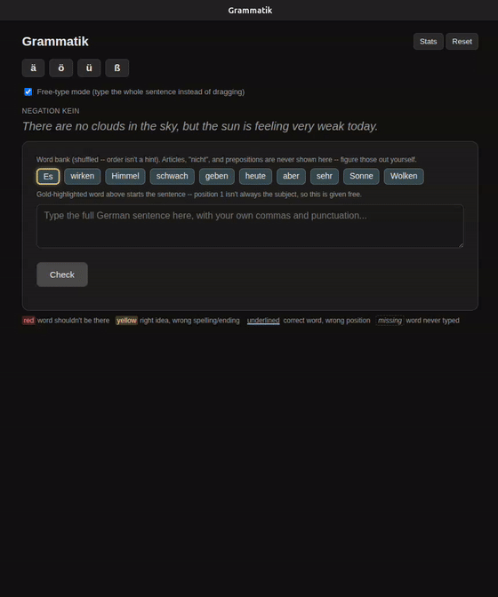
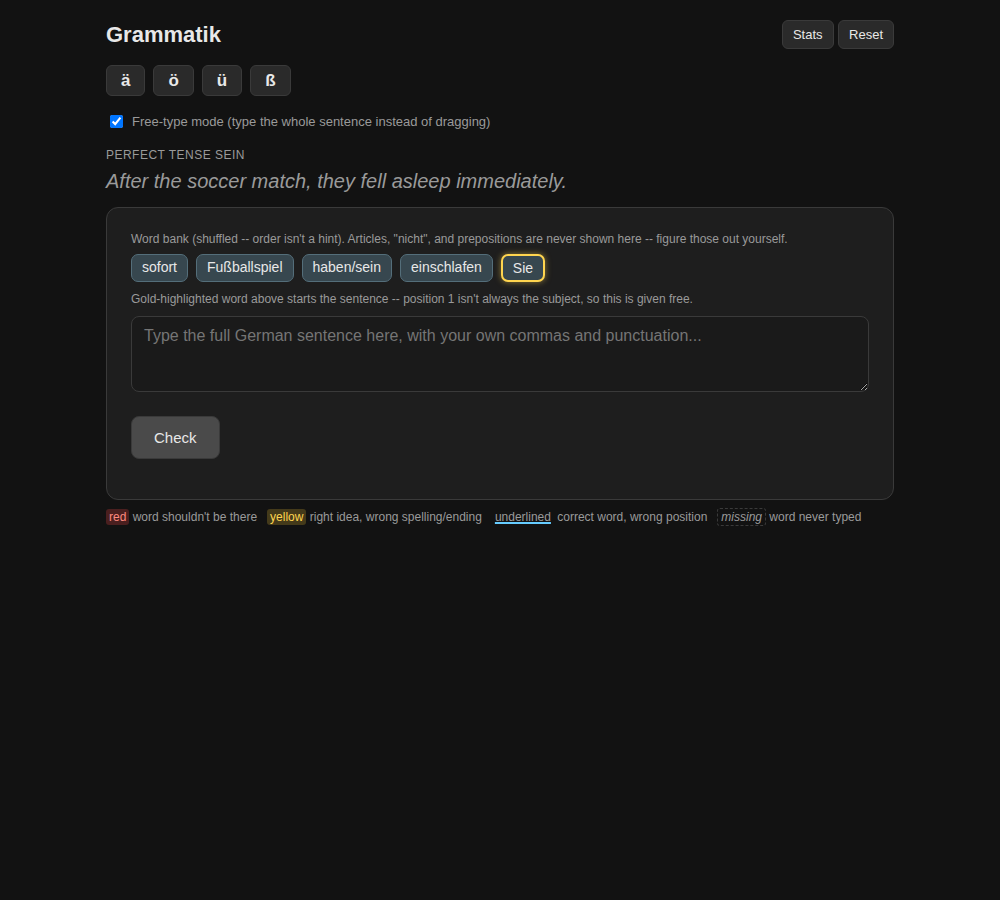

# Grammatik – German Sentence-Building Trainer (B1)



*24-second demo: typing a sentence (sped up), then the feedback and the word-by-word explanation. [Full recording (2 min 15 s)](media/demo.mp4)*

A browser app for practising German grammar by building sentences.

Each exercise gives you an English sentence and a shuffled word bank of German words in their base forms (e.g. *einschlafen*, *haben/sein*). You write the German sentence with the right word order, verb forms, cases and endings.

- **17,154 exercises** in **27 grammar categories**, aimed at the Goethe B1 level
- Articles, *nicht* and prepositions are **never given**; you work them out yourself
- Two modes: drag the words into place, or **free-type** the whole sentence (including your own commas)
- Colour-coded feedback on every word:
  - **red**: word shouldn't be there
  - **yellow**: right idea, wrong spelling or ending
  - **underlined**: right word, wrong position
  - ***missing***: word never typed
- An **explanation for every exercise**: why each part of the sentence goes where it does
- **Read-aloud** in German and a **microphone pronunciation check**
- Ä / Ö / Ü / ß buttons and statistics on what you get right and wrong
- Nothing to install: it's a single web page



## AI models used

This project was built with the assistance of **Claude AI** (Anthropic): the app, the sentence data, all the scripts in `generation_code/` including the reconstructed generator, and this README.


1. **Claude** (by Anthropic), used through Claude Code
   - wrote most of the original sentences (German sentence + English translation) in batches, directly in Claude Code sessions
   - designed the app and wrote all the Python scripts in [`generation_code/`](generation_code/)

   No script exists for the AI-written sentences, because they were written as text, not generated by code. The one big exception is Konjunktiv II and modal verbs: those were generated by a script, which has been [reconstructed](#reconstructed-generator).

2. **Mistral Small** (by Mistral AI, France): 24 billion parameters, 4-bit quantised (Q4_K_M), run locally with [Ollama](https://ollama.com)
   - wrote the explanation for every exercise
   - added grammar details (case, gender, verb clusters, idioms …)
   - fixed every error the rule-based checkers found
   - 17 of the scripts in `generation_code/` use it (marked **[AI]** below)

   Chosen because it's strong in European languages and fits on a 16 GB graphics card, so tens of thousands of calls cost nothing.

3. **No AI**: rule-based Python checkers and two template generators (see [Generation code](#generation-code)).

## Platform and testing

This app was **created entirely on Linux (Ubuntu)**.

It has **only been tested on Linux, in Google Chrome**. It has **not** been tested on Windows or Mac yet. It's a plain web page with no installs and no Linux-specific code, so it should work on Windows and Mac in a modern browser. The browser table below is expected behaviour, not test results. If something doesn't work on your system, please open an issue.

## How to use it

**Online (easiest):** open the GitHub Pages link of this repository in Chrome or Edge.

**On your own computer:**
1. Download this repository (green **Code** button → **Download ZIP**) and unzip it.
2. Start a small local web server in the folder. This needs [Python](https://www.python.org/downloads/), which is already installed on Mac and Linux:
   ```bash
   cd grammatik_German_Schreiben_App
   python3 -m http.server 8000
   ```
   On Windows, type `python` instead of `python3`.
3. Open http://localhost:8000 in Chrome or Edge.

You can also open `index.html` directly by double-clicking it, but the browser then won't remember the microphone permission. The web server (or the GitHub Pages link) avoids that.

Your statistics are saved in your own browser on your own device. They aren't uploaded anywhere, and they don't carry over to another browser or computer.

## Browser support

Expected behaviour; see [Platform and testing](#platform-and-testing).

| Feature | Chrome / Edge (Win, Mac) | Safari (Mac) | Firefox |
|---|---|---|---|
| Exercises, stats, Ä/Ö/Ü buttons | ✅ | ✅ | ✅ |
| Speaker (read aloud in German) | ✅ | ✅ | ✅ |
| Microphone pronunciation check | ✅ | ⚠️ mostly works | ❌ not supported |

**Recommended: Chrome or Edge.** The speaker and microphone use the browser's built-in speech features. For the best German voice, make sure a German voice is available (Chrome includes "Google Deutsch").

## Grammar categories

| Category | Exercises | Example |
|---|---:|---|
| Konjunktiv II | 2,405 | *Du würdest den DJ buchen.* |
| Modal verb forms | 2,350 | *Du musst den Hund baden.* |
| Da-compounds (darauf, damit, darum …) | 2,000 | *Es geht darum, mehr zu üben.* |
| Perfekt with *haben* | 1,066 | *Du hast das Auto gekauft.* |
| Perfekt with *sein* | 1,042 | *Er ist beim Arzt eingeschlafen.* |
| Relative clauses | 800 | *Der Mann, der dort arbeitet, verdient gut.* |
| Negation with *kein* | 661 | *Die Gäste haben kein Auto.* |
| Dative of interest | 500 | *Das Kind wäscht dir das Auto.* |
| Negation with *nicht* | 485 | *Du liest das Buch nicht.* |
| Verbs with fixed prepositions | 476 | *Ich warte auf den Bus.* |
| Modal verb + infinitive | 424 | *Du darfst die Tür öffnen.* |
| Order of two pronouns / objects | 407 | *Ich bringe ihr das Brot.* |
| Subordinate clauses | 326 | *Du kommst später, weil es schon spät ist.* |
| Dative prepositions | 320 | *Du passt zu dem Stil.* |
| Two-way prepositions: motion (accusative) | 320 | *Du gehst in den Park.* |
| Two-way prepositions: location (dative) | 320 | *Du bist in dem Park.* |
| Adjective endings | 320 | *Ihr seht den alten Turm.* |
| Accusative prepositions | 320 | *Du bittest um den Rat.* |
| *weil* vs. *denn* | 317 | *Du kochst Pasta, weil du keine Zeit hast.* |
| Reflexive pronouns | 317 | *Du freust dich auf die Reise.* |
| Indefinite and possessive articles | 299 | *Er möchte einen Kaffee trinken.* |
| Separable verbs | 292 | *Du holst das Paket ab.* |
| Definite articles in different cases | 278 | *Der Hund sucht nach dem Ball im Garten.* |
| Passive voice | 278 | *Das Buch ist gelesen worden.* |
| Coordinating conjunctions | 277 | *Es regnet heute, aber ich treibe trotzdem Sport.* |
| Sentences with several verbs | 277 | *Ich gehe ins Schwimmbad, weil ich schwimmen lernen möchte.* |
| *sondern* | 277 | *Es gibt kein Brot, sondern Brötchen.* |
| **Total** | **17,154** | |

## How the sentences were made

The exercises were produced with AI and then checked automatically against fixed German grammar rules. Every sentence went through these steps:

1. **Writing the sentences.** Most sentences (German + English translation, per category) were written by Claude (Anthropic) in batches in Claude Code sessions, as text rather than by code.

   **Konjunktiv II and modal verbs (4,755 sentences)** were generated by a script that combines one list of verb phrases with every subject and verb form. The original script was lost; a [reconstruction](#reconstructed-generator) reproduces 95% of these sentences exactly.

   Two more categories were built **without AI, from Python templates**:
   - Dative of interest (500): [`generate_dative_possession_exercises.py`](generation_code/generate_dative_possession_exercises.py)
   - Verbs with fixed prepositions (476): [`generate_prep_idiom_exercises.py`](generation_code/generate_prep_idiom_exercises.py), built from a list of verb + preposition combinations that had already been checked

2. **Turning sentences into exercises.** Each sentence is split into "chips": verbs in the infinitive, nouns with their article, prepositions, negation words and so on. Each chip stores the correct form and position. Extra grammar information is added, such as case and gender of noun phrases, definite vs. indefinite, verb clusters and reflexive datives.

3. **Writing the explanations.** For every exercise, Mistral Small explains each part of the sentence, e.g. *"bei meinem Friseur: bei always takes the dative."* See [`generate_explanations.py`](generation_code/generate_explanations.py).

4. **Checking the grammar (rule-based, not AI).** AI models make mistakes, so the output was checked with Python scripts that know hard grammar facts:
   - **Coverage:** the explanation must cover every word of the sentence, including correct umlauts.
   - **Cases** ([`check_case_accuracy.py`](generation_code/check_case_accuracy.py)):
     - Fixed-case prepositions are checked against a table: *mit, bei, seit, von, zu, aus, nach …* always take the **dative**; *für, durch, ohne, gegen, um …* the **accusative**; *wegen, trotz, während, statt …* the **genitive**.
     - Two-way prepositions (*in, an, auf, über, unter, vor, hinter, neben, zwischen*) are checked against the exercise: motion = accusative, location = dative.
     - Contractions are understood (*im = in dem*, *zum = zu dem*, *ins = in das* …).
   - **Word order** ([`check_verb_order_v2.py`](generation_code/check_verb_order_v2.py)): statements in the explanations, such as "'nicht' comes before the verb", are checked against the actual word positions in the sentence (verb position, *nicht*, separable prefixes).
   - **Idioms:** checked in four passes, each stricter than the last. The final pass throws out "idioms" that are really just literal translations (e.g. *den Wein probieren* = "to taste the wine").

5. **Fix and repeat.** Every exercise that failed a check was sent back to the AI with the specific error, fixed, and checked again ([`run_check_and_fix_cycle.sh`](generation_code/run_check_and_fix_cycle.sh)). This cycle ran until the checks passed.

Even so, a dataset this large can still contain occasional mistakes. If you find one, please open an issue with the exercise text.

## Generation code

[`generation_code/`](generation_code/) contains all the scripts used to build and check the exercises. They were written for the original development machine (Linux) and are included so you can see exactly how the data was made. They read and write `exercises.jsonl` / `explanations.jsonl` (one exercise per line) in the folder they're run from; the app files `exercises.js` / `explanations.js` were produced from those. Scripts marked **[AI]** need Ollama running with the Mistral Small model: `ollama pull mistral-small`

**Making exercises and explanations**

| Script | What it does |
|---|---|
| `generate_explanations.py` | **[AI]** explanation for every exercise |
| `generate_dative_possession_exercises.py` | template generator: dative of interest |
| `generate_prep_idiom_exercises.py` | template generator: verbs with fixed prepositions |
| `merge_explanations.py` | merges explanations with all fix/enrich patches and writes `explanations.js` |

**Adding grammar details to the explanations**

| Script | What it does |
|---|---|
| `enrich_case_gender.py` | **[AI]** states case + gender of noun phrases |
| `enrich_definiteness.py` | **[AI]** definite vs. indefinite word-order rule |
| `enrich_verb_clusters.py` | **[AI]** verb placement in multi-verb sentences |
| `enrich_verb_cluster_order.py` | **[AI]** order inside verb clusters |
| `enrich_reflexive_dative.py` | **[AI]** reflexive pronouns in the dative |
| `enrich_idiom_phrase.py` | **[AI]** explains fixed phrases |
| `enrich_all_idioms.py` | **[AI]** explains every detected idiom |
| `find_definiteness_candidates.py` | finds exercises needing the definiteness rule |

**Idiom detection (4 passes, each stricter)**

| Script | What it does |
|---|---|
| `detect_all_idioms.py` | **[AI]** pass 1: find candidate idioms |
| `verify_idiom_candidates.py` | **[AI]** pass 2: re-check, reject literal phrases |
| `verify_idioms_pass3.py` | **[AI]** pass 3: reject idioms English uses too |
| `verify_idioms_pass4.py` | **[AI]** pass 4: mechanical dictionary-meaning test |

**Rule-based checkers (no AI)**

| Script | What it does |
|---|---|
| `check_coverage.py` | the explanation must cover every word of the sentence |
| `check_case_accuracy.py` | preposition case table, two-way prepositions, contractions (*im, zum, ins* …) |
| `check_verb_order.py` | word-order claims vs. real word positions |
| `check_verb_order_v2.py` | stricter version, also tracks nouns and "before/after the subject/verb/object" claims |

**Fixing errors**

| Script | What it does |
|---|---|
| `fix_case_errors.py` | **[AI]** rewrites explanations with case errors |
| `fix_order_errors.py` | **[AI]** rewrites explanations with order errors |
| `fix_coverage.py` | **[AI]** regenerates explanations that miss words |
| `fix_umlaut_coverage.py` | restores ä/ö/ü flattened to a/o/u |
| `fix_bevor_comma.py` | adds the required comma before *bevor* |
| `fix_corpus_case_tags.py` | hand-verified case-tag corrections |
| `run_check_and_fix_cycle.sh` | runs the check → fix loop in order |

**Cleaning up chips and nouns**

| Script | What it does |
|---|---|
| `classify_bare_nouns.py` | **[AI]** is a capitalised word a noun or a name? |
| `classify_noarticle_nouns.py` | **[AI]** same, for nouns without an article |
| `convert_bare_nouns.py` | turns bare nouns into proper noun-phrase chips |
| `backfill_noarticle_gender.py` | fills in gender from the rest of the data |
| `known_genders.py` | hand-built gender list for rare nouns |
| `classify_stranded_words.py` | finds words not attached to a chip |
| `reattach_stranded_words.py` | attaches them to the right chip |
| `merge_stranded_adjectives.py` | joins adjectives to their noun (with endings) |
| `split_bare_noun_phrases.py` | splits merged article+noun chips |
| `split_bare_noun_adj_phrases.py` | same, with adjectives |
| `split_bare_noun_zu_infinitive.py` | splits "[noun] zu [infinitive]" chips |
| `split_bare_prep_phrases.py` | splits preposition+article+noun chips |
| `split_multiword_bare_noun.py` | splits multi-word noun chips |

**Other**

| Script | What it does |
|---|---|
| `no_cache_server.py` | local web server that always serves fresh files |

### Reconstructed generator

[`generation_code/reconstructed/generate_konjunktiv_modal_sentences.py`](generation_code/reconstructed/generate_konjunktiv_modal_sentences.py)

The script that generated the Konjunktiv II and modal-verb sentences wasn't saved, so it was **rebuilt from the patterns in the finished data, with the assistance of Claude AI** (Anthropic). Every sentence follows the same pattern:

```
SUBJECT              + VERB FORM          + VERB PHRASE
Du                     würdest              mehr Sport treiben.
Ihr                    könnt                heute Abend ausgehen.
Die Ärzte              dürfen               die Rate erhöhen.
```

- **Verb phrases:** 887, extracted from the data into [`konjunktiv_modal_lists.json`](generation_code/reconstructed/konjunktiv_modal_lists.json) (*früh aufstehen, das Auto reparieren, die Prüfung bestehen* …)
- **Subjects:** *ich, du, er, sie, wir, ihr, Sie*, plus 12 plural nouns (*die Kollegen, die Ärzte, die Mieter* …)
- **Verb forms:** *würde*; *können, müssen, dürfen, sollen, wollen, möchten* in the present; Präteritum (*konnte, musste* …); Konjunktiv II (*könnte, müsste* …)

It generates every combination (235,942 different sentences); the app uses a filtered selection of them. Tested against the real data:

| Category | Reproduced exactly |
|---|---|
| Konjunktiv II | 2,213 / 2,405 (92.0%) |
| Modal verb forms | 2,320 / 2,350 (98.7%) |

The remaining 5% are small hand-written sets that it doesn't cover: *hätte/wäre* + participle (*Ich hätte das gemacht.*), modal Perfekt (*Ich habe nicht kommen können.*) and *wenn* sentences.

```bash
cd generation_code/reconstructed
python3 generate_konjunktiv_modal_sentences.py                                  # writes all combinations
python3 generate_konjunktiv_modal_sentences.py --verify path/to/exercises.jsonl # compare with real data
```

**Known issue:** about 34 exercises in "Coordinating conjunctions" are missing the required comma before *aber* (commas weren't covered by the checkers).

## Files

| File | What it is |
|---|---|
| `index.html` | the app (layout, logic, speech, statistics) |
| `exercises.js` | all 17,154 exercises with their chips and English translations |
| `explanations.js` | the explanation for every exercise |
| `media/` | `demo.gif`, `demo.mp4` and `screenshot.png` |
| `generation_code/` | all scripts used to make and check the exercises (see above) |
| `generation_code/reconstructed/` | rebuilt generator for Konjunktiv II and modal-verb sentences |
| `README.md` | this file |
